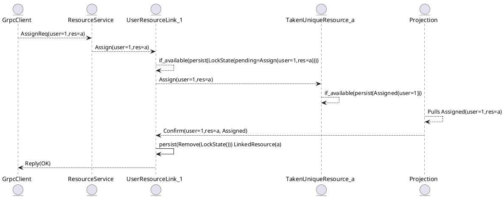
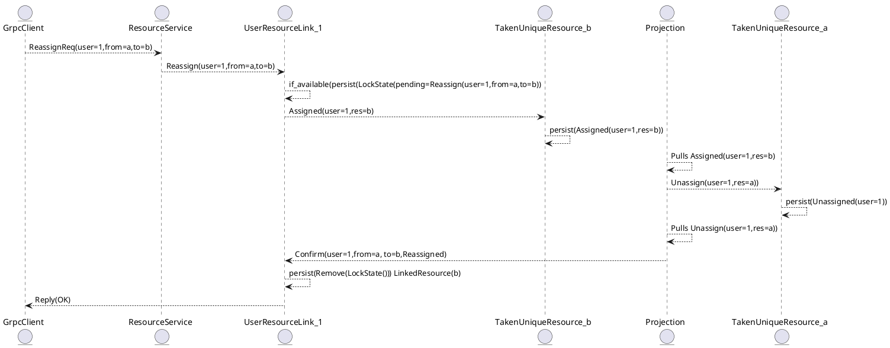

### Assign

```plantuml
@startuml

entity GrpcClient

entity ResourceService

entity UserResourceLink_1

entity TakenUniqueResource_a

entity Projection

GrpcClient --> ResourceService: AssignReq(user=1,res=a)
ResourceService --> UserResourceLink_1: Assign(user=1,res=a)
UserResourceLink_1 --> UserResourceLink_1: if_available(persist(LockState(pending=Assign(user=1,res=a)))) 
UserResourceLink_1 --> TakenUniqueResource_a: Assign(user=1,res=a)


TakenUniqueResource_a --> TakenUniqueResource_a: if_available(persist(Assigned(user=1)))  


Projection --> Projection: Pulls Assigned(user=1,res=a)
Projection --> UserResourceLink_1: Confirm(user=1,res=a, Assigned)
UserResourceLink_1 -> UserResourceLink_1: persist(Remove(LockState())) LinkedResource(a)
UserResourceLink_1 --> GrpcClient : Reply(OK)  

@enduml
```

### Reassign

```plantuml
@startuml

entity GrpcClient

entity ResourceService

entity UserResourceLink_1

entity TakenUniqueResource_b

entity Projection

entity TakenUniqueResource_a


GrpcClient --> ResourceService: ReassignReq(user=1,from=a,to=b)
ResourceService --> UserResourceLink_1: Reassign(user=1,from=a,to=b)
UserResourceLink_1 --> UserResourceLink_1: if_available(persist(LockState(pending=Reassign(user=1,from=a,to=b))
UserResourceLink_1 --> TakenUniqueResource_b: Assigned(user=1,res=b)
TakenUniqueResource_b --> TakenUniqueResource_b: persist(Assigned(user=1,res=b))

Projection --> Projection: Pulls Assigned(user=1,res=b)  
Projection --> TakenUniqueResource_a:  Unassign(user=1,res=a))
TakenUniqueResource_a --> TakenUniqueResource_a : persist(Unassigned(user=1))

Projection --> Projection: Pulls Unassign(user=1,res=a))
Projection --> UserResourceLink_1: Confirm(user=1,from=a, to=b,Reassigned) 
UserResourceLink_1 --> UserResourceLink_1: persist(Remove(LockState())) LinkedResource(b)
UserResourceLink_1 --> GrpcClient : Reply(OK)

@enduml
```