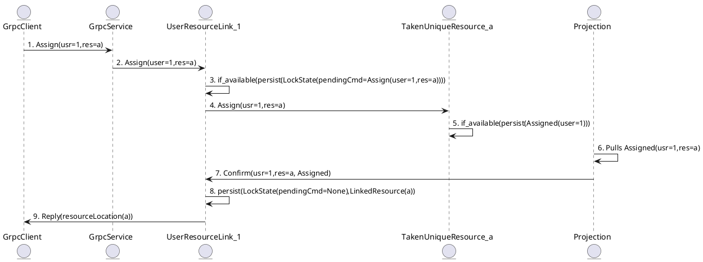
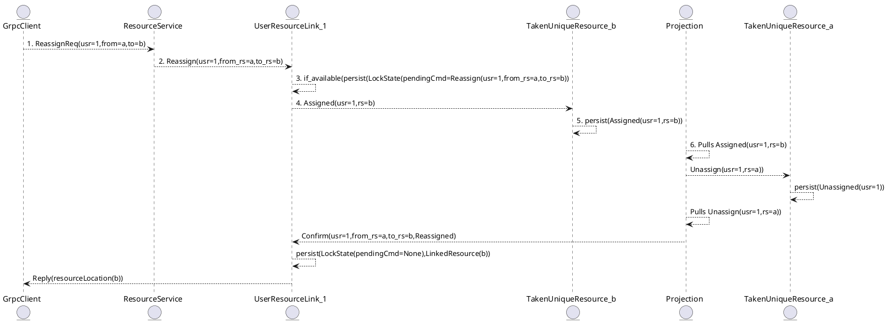

### Assign

```plantuml
@startuml

entity GrpcClient

entity GrpcService

entity UserResourceLink_1

entity TakenUniqueResource_a

entity Projection

GrpcClient -> GrpcService:1. Assign(usr=1,res=a)
GrpcService -> UserResourceLink_1:2. Assign(user=1,res=a)
UserResourceLink_1 -> UserResourceLink_1:3. if_available(persist(LockState(pendingCmd=Assign(user=1,res=a)))) 
UserResourceLink_1 -> TakenUniqueResource_a:4. Assign(usr=1,res=a)


TakenUniqueResource_a -> TakenUniqueResource_a:5. if_available(persist(Assigned(user=1)))  


Projection -> Projection:6. Pulls Assigned(usr=1,res=a)
Projection -> UserResourceLink_1:7. Confirm(usr=1,res=a, Assigned)
UserResourceLink_1 -> UserResourceLink_1:8. persist(LockState(pendingCmd=None),LinkedResource(a))
UserResourceLink_1 -> GrpcClient:9. Reply(resourceLocation(a))  

@enduml
```

### Reassign

```plantuml
@startuml

entity GrpcClient

entity ResourceService

entity UserResourceLink_1

entity TakenUniqueResource_b

entity Projection

entity TakenUniqueResource_a


GrpcClient --> ResourceService:1. ReassignReq(usr=1,from=a,to=b)
ResourceService --> UserResourceLink_1:2. Reassign(usr=1,from_rs=a,to_rs=b)
UserResourceLink_1 --> UserResourceLink_1:3. if_available(persist(LockState(pendingCmd=Reassign(usr=1,from_rs=a,to_rs=b))
UserResourceLink_1 --> TakenUniqueResource_b:4. Assigned(usr=1,rs=b)
TakenUniqueResource_b --> TakenUniqueResource_b:5. persist(Assigned(usr=1,rs=b))

Projection --> Projection:6. Pulls Assigned(usr=1,rs=b)  
Projection --> TakenUniqueResource_a:  Unassign(usr=1,rs=a))
TakenUniqueResource_a --> TakenUniqueResource_a : persist(Unassigned(usr=1))

Projection --> Projection: Pulls Unassign(usr=1,rs=a))
Projection --> UserResourceLink_1: Confirm(usr=1,from_rs=a,to_rs=b,Reassigned) 
UserResourceLink_1 --> UserResourceLink_1: persist(LockState(pendingCmd=None),LinkedResource(b))
UserResourceLink_1 --> GrpcClient : Reply(resourceLocation(b))

@enduml
```