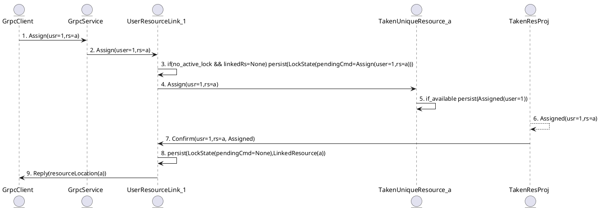
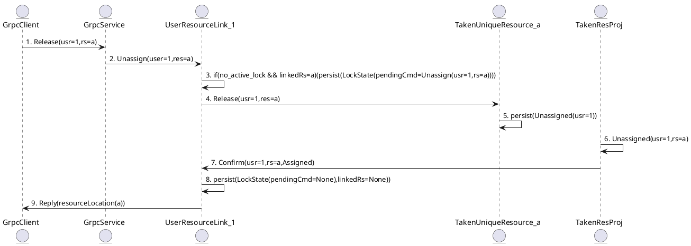
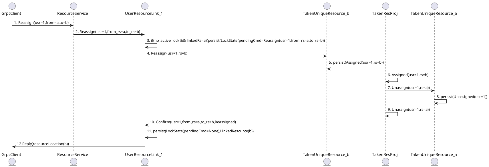

## 1. Assign a resource to a user

Assign `resource(a)` to `user(1)`

## 2. Release a resource
Given `user(1)` is linked to `resource(a)`

`user(1)` should release `resource(a)`

## 3. Reassign a resource to a user

It is a 2-step operation. Given `user(1)` is linked to `resource(b)` we need to do the following:

a) Assign `resource(b)` to `user(1)`

b) Unassign `resource(a)` from `user(1)`

