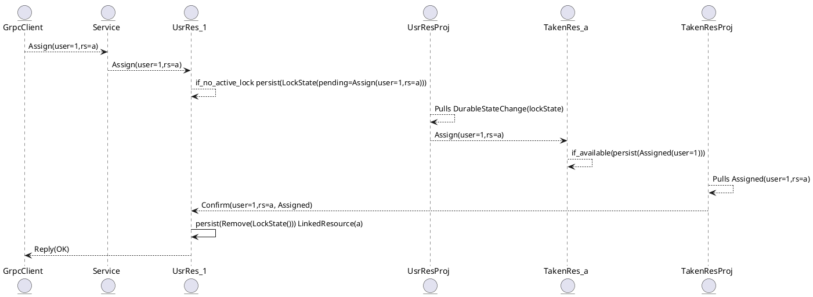
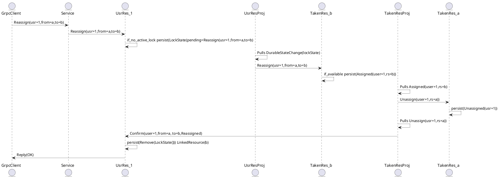
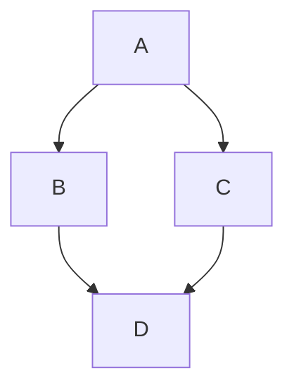

### Assign

```plantuml
@startuml

entity GrpcClient

entity Service

entity UsrRes_1

entity UsrResProj

entity TakenRes_a

entity TakenResProj

GrpcClient --> Service: Assign(user=1,rs=a)
Service --> UsrRes_1: Assign(user=1,rs=a)
UsrRes_1 --> UsrRes_1: if_no_active_lock persist(LockState(pending=Assign(user=1,rs=a))) 

UsrResProj --> UsrResProj: Pulls DurableStateChange(lockState) 
UsrResProj --> TakenRes_a: Assign(user=1,rs=a) 

TakenRes_a --> TakenRes_a: if_available(persist(Assigned(user=1)))  


TakenResProj --> TakenResProj: Pulls Assigned(user=1,rs=a)
TakenResProj --> UsrRes_1: Confirm(user=1,rs=a, Assigned)
UsrRes_1 -> UsrRes_1: persist(Remove(LockState())) LinkedResource(a)
UsrRes_1 --> GrpcClient : Reply(OK)  

@enduml
```

### Reassign

```plantuml
@startuml

entity GrpcClient

entity Service

entity UsrRes_1

entity UsrResProj

entity TakenRes_b

entity TakenResProj

entity TakenRes_a


GrpcClient --> Service: Reassign(usr=1,from=a,to=b)
Service --> UsrRes_1: Reassign(usr=1,from=a,to=b)
UsrRes_1 --> UsrRes_1: if_no_active_lock persist(LockState(pending=Reassign(usr=1,from=a,to=b)

UsrResProj --> UsrResProj: Pulls DurableStateChange(lockState)

UsrResProj --> TakenRes_b: Reassign(usr=1,from=a,to=b)  

TakenRes_b --> TakenRes_b: if_available persist(Assigned(user=1,rs=b))

TakenResProj --> TakenResProj: Pulls Assigned(user=1,rs=b)  
TakenResProj --> TakenRes_a: Unassign(user=1,rs=a))
TakenRes_a --> TakenRes_a: persist(Unassigned(usr=1))

TakenResProj --> TakenResProj: Pulls Unassign(usr=1,rs=a))
TakenResProj --> UsrRes_1: Confirm(user=1,from=a, to=b,Reassigned) 
UsrRes_1 --> UsrRes_1: persist(Remove(LockState())) LinkedResource(b)
UsrRes_1 --> GrpcClient : Reply(OK)

@enduml
```

### Test

```mermaid
  graph TD;
      A-->B;
      A-->C;
      B-->D;
      C-->D;
```