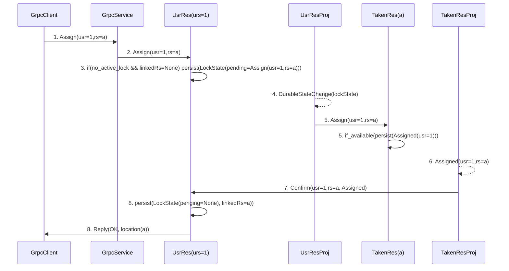
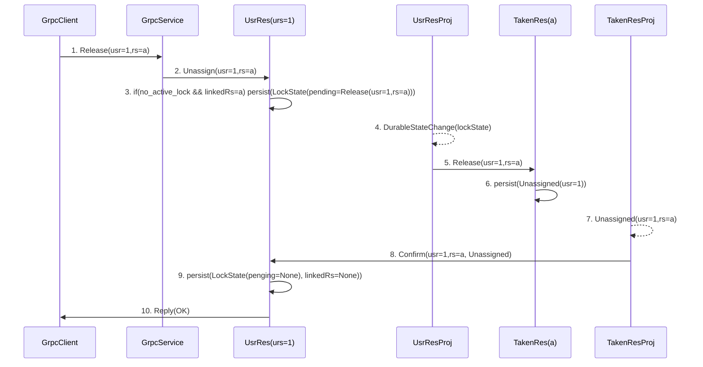
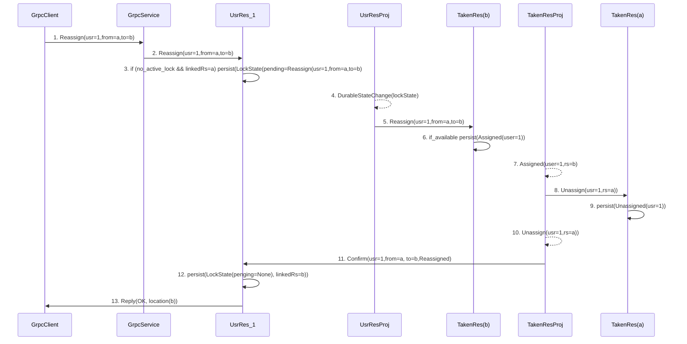

## 1. Assign a resource to a user (happy case scenario)

Assign resource(a) to user(1)

## 2.  Release a resource (happy case scenario)

user(1) releases resource(a)

### 2. Reassign a resource to a user (happy case scenario)
2-step operation:

a) Assign resource(b) to user(1) 

b) Unassign resource(a) from user(1) 

